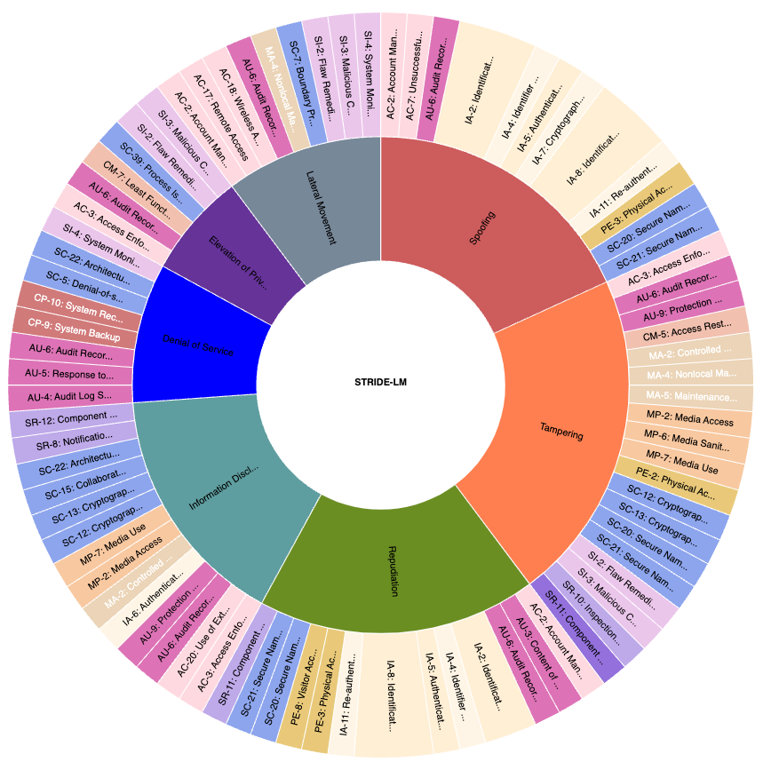

# Threat Modeling Framework and SOP

## Contents
- Introduction  
- Threat Modeling Process  
- Understand The Context Of The Use Cases Of The Solution  
- Determine The Strata(s) Involved For The Solution  
- Decompose The Solution (Application, Network, etc) Into Service Segments, Components And Modules  
- Determine And Rank Threats  

- Determine Countermeasures and Mitigation  
- Address Trade-offs  
- To-do Review Process  

---

## [To-do] section
1. Ease of implementation across more than just our team (this will include presenting, gaining alignment, and training others)  
2. Ability to use a 3rd party tool to facilitate and provide accurate information faster than manual  
3. Ability for us to peer inside of source code, and not get bogged down in the minutia.  
4. Explanations and alignment of how both the tool and framework fit together and work to accelerate each other.  

##### To-do Review Process
To ensure the listed tasks are addressed efficiently, the following process will be followed:
- **Task Prioritization:** Rank items based on impact and feasibility.
- **Stakeholder Alignment:** Engage relevant teams for input and agreement.
- **Implementation Plan:** Define milestones, responsible parties, and timelines.
- **Progress Tracking:** Regular status updates and adjustments as needed.

---

## Introduction
This document describes a structured approach to solution threat modeling to identify, quantify, and address the security risks associated with a proposed solution.  
Threat modeling involves examining a system from the perspective of a potential attacker. The threat modeling process comprises the following steps, with documentation recorded at each stage.  

## Threat Modeling Process

**Step 1**: Understand the context of the use cases of the solution  
**Step 2**: Determine the strata(s) involved of the solution  
**Step 3**: Decompose the solution (Application, Network, etc) into service segments, components and modules  
**Step 4**: Determine and Rank Threats  
**Step 5**: Determine Countermeasures and Mitigation  
**Step 6**: Address Trade-offs  


### Step 1: Understand the context of the use cases of the solution
The foundational Step 1 involves a comprehensive understanding of the context surrounding the use cases of the solution. This initial phase is crucial for establishing a clear framework and identifying the specific scenarios in which the system will operate. By comprehensively grasping the context, threat modeling can be aided with the insights of the intricacies of user interactions, data flows, and the overall purpose of the solution. This contextual awareness lays the groundwork for the subsequent steps in the threat modeling process, enabling a more precise and targeted analysis of potential security threats. Effectively discerning the use cases ensures that the threat modeling exercise aligns closely with the actual operational environment, enhancing the relevance and accuracy of the security assessments conducted in later stages.  

#### Step Breakdown
|   | Step | Input | Means | Participants | Output |
|------|------|-------|-------|-------------|--------|
| 1.1 | Ensure that everyone aligns on the same context, i.e. agree on definitions, assumptions, focus of the problems. etc. | Templates of definitions, FAQ, requirement documents (e.g. BRS, FRS, SRS), etc. | 1. Set up focus group 2. Structured interviews 3. Create FAQ| Stakeholders, Requirements task force (including engineers and architects) | Agreed definitions, assumptions, focus of the problems |
| 1.2 | Identify security principles and goals | Definitions, assumptions, focus of the problems, candidate goals, business drivers, policies and procedures, example | Conduct work sessions, surveys, collect metrics, etc. | Stakeholders, Requirements task force (including engineers and architects) | Principles and goals |

---

### Step 2: Determine the strata(s) involved for the solution
Step 2 of the threat modeling process involves identifying the strata(s) involved of the solution, encompassing the 7-strata domain, which includes Infrastructure (Network), Service (including Applications), System, Platform (Computing Language), Protocol, Algorithm, and Hardware.  

#### Step Breakdown
| Step | Input | Means | Participants | Output |
|------|-------|-------|-------------|--------|
| 2.1 | Develop artifacts to support security requirements | Potential artifacts (e.g., scenarios, misuse/abuse cases, templates) | Work sessions: Identify strata(s) involved | Engineers and architects | Scenarios of misuse/abuse cases, attack models, and scenarios |

---

### Step 3: Decompose the solution (Application, Network, etc) into service segments, components and modules
Step 3 entails the decomposition of the solution, which may comprise the application, network, and other elements, into service segments, components, and modules. This deconstruction allows for a detailed examination of the various building blocks within the system, providing a comprehensive understanding of its structure. 
 

#### Step Breakdown
| Step | Input | Means | Participants | Output |
|------|-------|-------|-------------|--------|
| 3.1 | Perform architectural assessments | Architecture diagrams, test logs, and reports | Work sessions: Decompose solution into segments and categorize requirements | Engineers and architects (including security specialists) | Architecture assessment reporting |

---

### Step 4: Determine and Rank Threats
Step 4 involves determining and ranking threats. This critical phase requires a meticulous analysis of potential vulnerabilities and risks associated with each identified component or module. By prioritizing these threats, security teams can focus their efforts on addressing the most significant and impactful risks to the system.   

#### Step Breakdown
| Step | Input | Means | Participants | Output |
|------|-------|-------|-------------|--------|
| 4.1 | Perform risk and threat assessments | Security principles and artifacts (misuse/abuse cases, attack models) | Work sessions: Threat modeling frameworks and risk assessments | Engineers and architects (including security specialists) | Risk assessment and threats reporting |

---

### Step 5: Determine Countermeasures and Mitigation
Step 5 is in determining countermeasures and mitigation strategies. This involves devising proactive measures and security controls to safeguard against the identified threats. Countermeasures may include implementing encryption protocols, access controls, or other security mechanisms tailored to address specific vulnerabilities within the system.  

#### Step Breakdown
| Step | Input | Means | Participants | Output |
|------|-------|-------|-------------|--------|
| 5.1 | Determine Countermeasures and Mitigation | Architecture assessment reporting | Work sessions: Countermeasure designs, prototyping/simulation | Engineers and architects (including security specialists) | Countermeasures, Mitigation strategies, Security test exit validation test plans |

---

### Step 6: Address Trade-offs
Step 6 addresses trade-offs. This stage acknowledges that implementing security measures can sometimes introduce trade-offs, such as performance impacts or usability constraints. Security professionals must carefully weigh these trade-offs and make informed decisions to strike a balance between robust security and maintaining the system's functionality and user experience. 

#### Step Breakdown
| Step | Input | Means | Participants | Output |
|------|-------|-------|-------------|--------|
| 6.1 | Address Trade-offs | Countermeasures, Mitigation strategies | Work sessions: Security testing, Performance benchmarking | Engineers and architects (including security specialists) | Security test exit validation tests and reports |

---

## Understand The Context Of The Use Cases Of The Solution
In threat modeling, the equivalent of understanding the context of the solution's use cases involves examination of use case context. This can be captured in a document such as the Business Requirement Specification (BRS). The BRS serves as a foundational document, encapsulating the entirety of requirements articulating why the solution exists. This document is instrumental in capturing the environmental nuances and business landscape within which the solution is expected to operate. It outlines the essential requirements that the system must fulfill, delineating the existing service level and the targeted improvements it aims to achieve. It serves as the starting point to propose preliminary security measures and garner consensus from stakeholders, ensuring a collective understanding of the security objectives. This sets the stage for a more in-depth exploration of potential threats in subsequent phases of the threat modeling process. 

## Determine The Strata(s) Involved For The Solution
### Define Objectives and Scope
Identify the scope of the threat modeling process, including the network topology, systems architecture, applications, or components to be assessed. 

### 7 Strata
A simplified and unified framework can be derived from multiple frameworks. The framework covers 7 strata. The focus is to have countermeasures and defenses designed against threats for the domains of infrastructures, systems, platform frameworks, schemes, protocols, and algorithms. 

The 7-strata domain framework is derived as a common denominator that covers the frameworks mentioned above. The idea is to capture the observability and controllability of the cybersecurity terrain addressed. The crux is to overcome complexity and the lack of visibility. 


#### The 7-Strata Domains:
1. **Infrastructure — Network**
2. **Service (including Applications)**
3. **System**
4. **Platform (Computing Language)**
5. **Protocol**
6. **Algorithm**
7. **Hardware**

### Infrastructure — Network
This stratum includes Network (network infrastructure, including routers, switches, firewalls, and other network devices). It involves measures to prevent unauthorized access, network attacks, and data interception, i.e. ingress and outgress of the network security boundary (perimeter). The network can be in the form of Cloud or other distributing computing topologies.  
 
This domain covers how the nodes are connected, and how they can be disconnected, which can pose MitM denial or attacks, e.g. network partitioning or division. Many enterprise environments are multi-cloud and multi-network connectivity. The complexity of configuration management, granular monitoring across platforms, and access control often lead to disjointed workflows that involve manual configuration and limit visibility exacerbates security challenges. 
This threat modeling on this domain covers how to secure network traffic wherever workloads run whether Cloud, on-prem or decentralized or distributed networks. Workload Protection protects system and network workloads end-to-end from source code to production. Gives enterprises (cloud, network, etc) agnostic unified visibility and threat prevention across apps, APIs, K8s clusters, and serverless functions. 
 
It is important to know where the domain boundaries are, and how each domain works seamlessly in tandem with each other. Firewalls protect services from the Internet. Malware shields within. The perimeter network security must be sufficient against cyber threats, even when data or workloads sit in the cloud. 

### Service (including Applications)

The services may be application, facilities, industrial facilities, banking services, development environment (CI/CD) facilities, etc, or any faculties that are represented, presented and manifest itself into a service. Services may be internal. This can be in the faculty of Governance, Risk, and Compliance (GRC, aligning security practices with its business objectives, assessing and managing risks, and ensuring compliance with industry regulations and standards), Identity and Access Management (IAM) as a form of Control, Security Operations Center (SOC, centralized team responsible for monitoring, detecting, analyzing, and responding to security incidents in real-time) as a form of Command and Control, Incident Response (Restoration and Recovery, Reformation and Refinement), Physical Security (securing physical assets, facilities, and equipment to prevent unauthorized access, theft, and other physical threats), etc. 
Services may be external for business focus, extension, expansion and continuity.  
 
This domain of services considers the defense propositions (against threats) when providing enterprise-grade application security (Appsec) for web applications and APIs. Enterprises can go beyond traditional rule-based protection and leverage the power of contextual AI to prevent threats with a high level of precision. 
It subsumes Posture Management by configuring governing policies via configuration management service systems. It automates the process of governance and enables enterprises to visualize and assess overall enterprise security posture, detect insecure configurations, and enforce best practices at scale. 
 
Applications can be porous and fine-grained. Comprising 100s of functions, many applications are tiny microservices with its own policies, role, API, audit trail, etc. This changes the attack surface, instead of a small number of entry points with lots of functionality hidden behind each one, there are now more entry points, each with a small part of the app behind it. Defending the application now requires thinking about each entry point. 
 
The domain covers user protection such as Application Security Threats to users. This includes: 
1. Account hijacking 
2. Credential exposure: Exposing credentials can lead to account hijacking and a wide range of sophisticated long-term attacks. 
3. Oversharing of data 
4. DoS attacks 
5. Phishing and social engineering 
6. Counter scams and frauds 
* Scams tend to rely on the victim's voluntary participation and psychological manipulation, while frauds involve more deliberate, often complex acts of deception and can lead to more serious legal consequences. 
7. Account for the human aspect: User error is one of the most common causes of data breaches. Taking a 2-pronged approach of user education and implementing security tooling such as URL filters, anti-malware, and intelligent firewalls can reduce the risk of social engineering leading to a catastrophic security issue. 

#### <u>Notes on Scams and Frauds</u>

##### [Intent]  
###### Scam  
Scams are designed to exploit the victim's gullibility or ignorance. They often rely on the victim's voluntary participation, albeit based on false information.  

###### Fraud  
Fraud involves deliberate deception or misrepresentation with the intention of gaining an unfair or illegal financial advantage.  

##### [Method]  
###### Scam  
Scams often rely on psychological manipulation, persuasion, and the victim's willingness to cooperate. Common types of scams include:  
- Lottery scams  
- Phishing scams  
- Romance scams  

###### Fraud  
Fraud schemes can be more complex and may involve forgery, identity theft, embezzlement, or other forms of financial deception. Types of fraud include:  
- Credit card fraud  
- Insurance fraud  
- Securities fraud  

##### [Victim Involvement]  
###### Scam  
Victims of scams are often active participants, albeit unknowingly. They are convinced to take certain actions, such as:  
- Sharing personal information  
- Sending money  
- Clicking on malicious links  

###### Fraud  
In fraud cases, victims may not be as actively involved. For example, identity theft can occur without the victim's knowledge until they discover unauthorized transactions on their accounts.  

##### [Scale]  
###### Scam  
Scams can target both individuals and organizations but are often smaller in scale, involving fewer victims at a time.  

###### Fraud  
Frauds can be larger in scale and may involve more significant financial losses. Corporate fraud, for instance, can affect a company's financial health and its shareholders.  

##### <b>Countermeasures</b>  
1. **Enable Multi-Factor Authentication (MFA).**  
2. **Enforce the principle of least privilege.**  
3. **Log incidents for legal evidence collection.**  

##### <b>Caveat(s)</b>  
There is also a thin line between offense and defense. Pentesting tools can also be crimeware.  


#### Services

While Endpoints can be seen as infrastructure, they are part of systems. This is the component of interface. Endpoint security involves securing individual devices whether mobile, Internet of Things (IoT), sensors, or any server or client devices that connect to a network. The goal is to prevent malware infections, unauthorized access, and data loss from these device systems. 
Systems also include critical infrastructure systems such as Industrial Control Systems (ICS) like power plants, manufacturing facilities, and utilities from cyber threats that could impact their operations.  
 
This domain provides Intelligence and protects enterprise workloads with threat prevention enabled by machine learning, world-class research, CVE watch and provides automatic remediation for configuration drift. 
Intelligence also includes to ingest log and event data, delivering contextualized visualization of entire infrastructure and security analytics, helping to enhance real-time intrusion detection and policy violation alerts based on user-defined criteria. This is part of comprehensive investigation of security threats, forensics and threat hunting, with network security analytics. 
It provides Multi-tenancy context segregation assurance, Data loss prevention (DLP), log and alert management as well as visualizations of security information across network system to coordinate to improve overall observability. It includes monitoring and responding to storage events, stream data processing, databases changes, code/ executables modifications, Notifications (e.g., SMS, Emails, IoT). 
The domain can be used to identify unused assets, map how security teams work, verify the integrity of a recently deployed system, and identify what technologies are most used. In this way, it can also help organizations save money and identify important opportunities for training. 

#### User Protection

This domain covers Application Security Threats to users, including:
1. Account hijacking
2. Credential exposure
3. Oversharing of data
4. DoS attacks
5. Phishing and social engineering
6. Counter scams and frauds
   - Scams: Rely on the victim's voluntary participation and psychological manipulation.
   - Frauds: Involve deliberate deception or misrepresentation to gain financial advantage.
7. Account for human errors by educating users and implementing security tooling.


#### Applications

While platform can be referred to as the <b>architecture, tools and processes</b>, including integrating vendor-specific functions—and often third-party products, that ensure the functions of an entire computing environment, we refer to the computing language platform base that runs within each system. This can be on any layer depending on the language platform (including the different forms of smart contract platforms) in use. 
Domain Specific Language Platform has to be managed and assured differently as they are self-styled by nature. 
Different languages have different `gotchas`, and the version of each language is changing fast. It behooves for the platform specialist to engage a team of specialized experts looking at the idiosyncrasies and flawed implementation that can occur for each language platform. Also note that, language can behave differently on different environments (cloud, mobile, embedded, etc), OS, runtime, hardware, etc. 

#### Protocol, Algorithm and Hardware 
As it may be language Platform related, this will affect the <b>Protocol</b> and <b>Algorithm</b> strata as the users are to be abstracted from the underlying workings and yet be guided by the tool itself on the limitation and scope of safety usage to ensure security being well-implemented and deployed. There has to be caveats if the <b>Hardware</b> and deployment is mobile, distributed, resource and energy limited (e.g. embedded), and/or subjected to hostile or harsh environment, etc. 

<b>Algorithm</b> domain can be on any layer depending on where and how the cryptographic suites are deployed, maintained and designated in usage. 
<b>Protocol</b> piece algorithms to be coordinated into a protocol for safe use and implementation. 
<b>Hardware</b> (+ IoT, embedded) can be on any layer that is designated and deployed for realizing the blockchain operations. 


##### Decompose The Solution (Application, Network, etc) Into Service Segments, Components And Modules 

The examination involves:
 **3.1.** Identify Assets and Data Flows 
 **3.2.** Subject, Interface and Object (SIO) Analysis 
 **3.2.1.** Dependencies 
 **3.2.2.** Entry Points and Exit Points 

##### 3.1 Identify Assets and Data Flows

Identify and document the critical assets, data flows, and trust boundaries within the system. Understand how data moves through the system and identify potential points of compromise.  

###### Audit

[1]. Proper documentation must be in-place for clarity on the critical data flow and security boundaries to be delineated. 
This does not include user guide or user set-up guide. Though use cases should be depicted.  
 
Documentations (architecture diagrams describing mechanisms) must be clear and direct to trace the secret generation, flow, and storage. Some fundamental premises must be covered: 

a. Strength of cryptography. 
a.1. What are the cipher suites used, i.e. ciphering, hashing, signing, etc? What are the key lengths used?   
a.2. What are the FIPS certification held by your solution? Is so, please cite them.  
a.3. How do you tend to your data at rest, data-in-transit, and data-in-processing? 

b. What are the secrets in use? What are they used for? (e.g. there should not be the same key for cipher and signing) What are their life-cycles? 
c. The secret generations (i.e. Has the RNG been tested for entropy?). 
d. How are the secrets distributed / populated?  
KMS (key management system) solution: How is your key management system like? i.e. Secrets management lifecycle (from generation to distribution to rotation / revocation to termination, etc). 
e. How did flow and storage ensure that the credentials are well guarded? Is there any point where it is transmitted or stored in plaintext? 
f. How are the secrets (keys, passcodes, etc) protected?   
g. What are the crypto objectives for each of the data objects of interest to be protected? (e.g. video, audio and short text may be ciphered and protected differently. The objective of confidentiality, privacy, integrity, and availability must be set as a clear criteria.) 
h. What are the data / parameters (sensitive/ secret) to be protected? 
- e.g. In some instances, as the SSO (Single-sign on) solutions deployed are using unsigned requests, while the usernames may not be of concern, it is more of how the credentials may be protected in the SSO.  

The known use case(s) must be stated, as certain use cases can affect the security requirements of the implementation. This involves what data and sensitive operations are involved, as well as which zone(s) these operations are running in. 
 
 [2]. Risk / gap analysis 
This includes any risk introduced for the exception to be filed. Which rule is the exception transgressing according to a developed Guide to Cryptography and Deployment Guidelines and/or Cryptographic Controls? State the reasons for the exception or omission. * All the mentioned criteria above are central to arriving at the decision for the exception approval. 
Given the risk / gap analysis, are there any countermeasures introduced to mitigate the risk introduced by the exception? State the effectiveness and limitations or the countermeasures to mitigate the risk introduced by the exception.  
 
a. All applications underwent a formal review process. 
b. Determination and segmentation of certain applications under graded / 1 single trust model. 
c. There is a sufficient detection mechanism to deter traveling private keys and leakage. 
d. The system(s) had undergone a hardening process. 
While filing the exception, always consider the security sufficiency, completeness and correctness aside the functionality to assert for the justification.  
  
[3]. Contingency plans 
State the detection, resistance, and recovery (repair, roll-back and restore) plan. 
 
Assets are documented in the threat model as follows: 
```
ID: A unique ID is assigned to identify each asset. This will be used to cross-reference the asset with any threats or vulnerabilities that are identified. 
Name: A descriptive name that clearly identifies the asset. 
Description: A description of what the asset is and why it needs to be protected. 
Trust Levels: The level of access required to access the entry point is stated here. These will be referenced with the trust levels with the components the asset is interacting with. 
```

1. **Trust Levels**

| ID     | Name                      | Description                                                                                                                                                                                                                                                                                                   |
|--------|---------------------------|---------------------------------------------------------------------------------------------------------------------------------------------------------------------------------------------------------------------------------------------------------------------------------------------------------------|
| CD_001 | Customer Database          | The database contains personally identifiable information (PII) of registered users, including names, addresses, and contact details. It is an asset for customer interactions and must be protected to ensure privacy and compliance with data protection regulations.                               |
| PG_001 | Payment Gateway            | The gateway facilitates secure online transactions, processing credit card information and financial data. This component is pivotal for the revenue stream of the application and demands protection to prevent unauthorized access or tampering.                                                             |
| SM_001 | Session Monitor            | The agent component is critical for tracking and managing user sessions within the application. It plays a crucial role in maintaining user authentication and authorization states, ensuring a secure and seamless user experience. The Session Monitor stores session tokens, user privileges, and other session-related data. |
|        | **Trust Levels Documentation** | Trust levels are documented in the threat model as follows:                                                                                                                                                                                                                                                                      |

Trust levels are documented in the threat model as follows: 
```
ID: A unique number is assigned to each trust level.  
Name: A descriptive name to identify the external entities that have been granted this trust level. 
Description: A description of the trust level detailing the external entity who has been granted the trust level. 
```

2. **Trust Levels Description**

| ID        | Name                            | Description                                                                                                                                                                                              |
|-----------|---------------------------------|----------------------------------------------------------------------------------------------------------------------------------------------------------------------------------------------------------|
| AS_001    | Authorized application servers  | Servers that serve as an intermediary between the client and the database.                                                                                                                                                                                                 |
| MS_001    | Microservices                   | Microservices may have their own databases or share a common database. Each microservice is responsible for managing its data and may interact with the database independently.                                                |
| PPM_001   | Payment processing module       | A dedicated payment processing module or service within the system is designed to interact specifically with the payment gateway. This module handles the creation of payment requests, processing responses from the payment gateway, and managing the overall payment flow. |
| BES_001   | Back-end server or middleware   | A back-end server or middleware may play a role in orchestrating communication between different components of the system and the payment gateway. It ensures that the necessary data is transmitted securely and that responses from the payment gateway are appropriately handled.       |
| SMW_001   | Security middleware             | Security middleware components, including intrusion detection systems or web application firewalls, may access the Session Monitor to monitor and analyze session-related activities for potential security threats or anomalies.                                |
| LAS_001   | Logging and auditing systems    | Logging and auditing systems may integrate with the Session Monitor to record session-related events and activities. This integration supports security auditing, compliance, and forensic analysis.                                            |

3.2. **Subject, Interface, and Object (SIO) Analysis**

Architecture draws the engineering paradigm to work out the components, relationships (and interactions / interface) of the functioning ecosystem to fulfill or manifest an enabling phenomenon. Architecture also helps us to understand the system. It is a blueprint to tool and capture the comprehension for both analysis and synthesis of solutions. 

Complicated systems always include room for error. A system can only be as secure as its weakest link. Problems with inconsistent naming, poorly-defined boundaries, highly-coupled interfaces and systems, and ambiguity in definitions or consideration of any condition are hints to a future disaster. A complex system with hidden flaws awaits for the glitch to spark cascading failures leading to a fateful fiasco. System designs are to be well-documented in separation of concerns, so that modules of the system may be independently developed and maintained. 

Complex systems will eventually collapse, often at a sudden, when complex legacy systems have no one fully understanding how it works. Nobody can subtract from the system; everyone just adds.  

Before any entities (whether user, system (server or mobile) or binaries that define an instance running a system) could participate in secure transactions, whether financial or non-fungible related, the subject must be trusted. This entity may even be related to a computation resource identity, such as a server or logic instance running or managing a process. Each <b>subject</b>, <b>object</b> and <b>interface</b> must be carefully profiled and registered. 

Always check for the environmental conditions, which may be side-channel or external. This includes hostile testing which goes beyond scaling or load or stress testing. Hostile testing may be proactive and deliberated by human means or it would be because of hostile environment and external factors. 

Examine all objects, subjects, interfaces and entities. The service and usage it is subjected to makes the difference. Whether the device is in the possession of the actors and the nature of the device matters. What the service or objects is applied on or to matters. The longevity and the durability of the solution must also come into consideration. Draw out the scopes and boundary condition assumptions, and place caveats where they may fail or be invalidated. 

Mandate the participating parties to agree on the <b>intent</b> of the onboarding. With this, the suitable <b>attributes</b> that will make up the credentials for the enrollment could be collected and checked. Having the intent clearly defined will also help to <b>scope</b> the use case, and therefore, set the association for <b>rights</b> and allowed <b>actions</b> of the service mapped effectively to the <b>identity</b> of the user. 

**4. Diagrams for Architectural Representation**

Having multiple diagrams to describe the architecture of a system provides a comprehensive and nuanced understanding of various aspects, helping different stakeholders to grasp different facets of the system. It is recommended to have 6 diagrams to describe the architecture: 

1. **User Case**
Purpose: Offers a high-level view of the system from a user's perspective, showcasing interactions between users and the system. It helps in identifying user roles, system functionalities, and the relationships between them. 

2. **Timing, Swimlane (Sequence)**: 
Purpose: Illustrates the chronological order of interactions between different components or actors in the system over time. Useful for visualizing the sequence of events, dependencies, and the timing of activities during the execution of a specific use case. 

3. **Flow Chart**: 
Purpose: Provides a detailed step-by-step representation of processes and decision-making within the system. Useful for understanding the logical flow of actions, conditions, and decisions, aiding in the analysis of system behavior. 

4. **State Machine**: 
Purpose: Represents the different states that a system or component can exist in and the transitions between these states in response to events. Useful for modeling the behavior of entities within the system and understanding how they respond to stimuli over time. 

5. **Block-Component Flow**: 
Purpose: Depicts the major components of the system as blocks or modules and illustrates the flow of data or control between them. Useful for understanding the high-level architecture and the relationships between major components in terms of data or control flow. 

6. **Entity-Relationship**: 
Purpose: Models the relationships between different entities (such as database tables) within the system. It helps in understanding the structure of data and how different entities are related, facilitating database design and optimization. 
 
{Data flow diagrams examples to be given} 

**3.2.1. Dependencies**
Dependencies, whether originating internally or externally, encompass elements that could potentially pose risks to its security where a flaw or malware resides. When addressing dependencies, materials such as the Software Bill of Materials (SBoMs) can provide insights.  

It is essential to recognize that dependencies play a pivotal role in the overall security posture of an application. External dependencies, which might include third-party libraries, frameworks, or components, can introduce vulnerabilities or impact the security of the entire system. Understanding the intended runtime environment of the application is crucial. For instance, if the application is designed to operate on a server compliant with the organization's hardening standards and is intended to be situated behind a firewall, documenting these specifications becomes imperative within the dependencies section of the SBoM. This documentation aids in comprehensively assessing and managing the security implications associated with external dependencies throughout the software development and deployment lifecycle. 

Dependencies should be documented as follows: 
```
1. ID: A unique ID assigned to the dependency. 
2. Description: A description of the dependency. 
```

| ID     | Description                                                                                                                                       |
|--------|---------------------------------------------------------------------------------------------------------------------------------------------------|
| LIB001 | Third-party library for cryptographic functions. This dependency is utilized to enhance the application's security by implementing robust encryption algorithms. |
| FW002  | Represents the firewall solution integrated into the application's infrastructure, providing a crucial layer of defense.                          |
| API003 | External API for Payment Processing. This dependency facilitates communication with a third-party payment processing service.                      |

In the defensive SDLC, SBoM formats are encouraged for traceable details for forensics. 
 
**3.2.2. Entry Points and Exit Points**
Entry points are the interfaces where potential attackers interact with the components. Exit points are the interfaces where potential attackers may extract from the components. 

The defensive SDLC emphasizes traceable details for forensics. SBoM formats are encouraged for dependency management and software lifecycle management.

Threats associated with <b>entry</b> points may include: 
```
Injection Attacks: Malicious actors may attempt to exploit entry points by injecting malicious code, such as SQL injection or Cross-Site Scripting (XSS), to manipulate data or compromise the integrity of the system. 

Unauthorized Access: Threats involving unauthorized access may target entry points to gain illicit entry into the system. This could involve exploiting weak authentication mechanisms or attempting to bypass access controls. 

Denial-of-Service (DoS) Attacks: Entry points are susceptible to DoS attacks, where malicious entities overwhelm the system with excessive requests, leading to service disruption and potential downtime. 

Input Validation Issues: Failure to adequately validate and sanitize inputs at entry points may expose the system to input-related vulnerabilities, allowing attackers to manipulate and misuse data. 
```
 
Threats associated with <b>exit</b> points may include: 
```
Data Leakage: Inadequate protection at exit points can result in unintentional data leakage, exposing sensitive information to unauthorized entities during data transfer. 

Man-in-the-Middle Attacks: Exit points are susceptible to interception by malicious actors, leading to Man-in-the-Middle attacks. This threat could compromise the confidentiality and integrity of data transmitted between the system and external entities. 

Insecure Data Storage: Improper handling of data at exit points may contribute to insecure data storage, creating opportunities for unauthorized access or data tampering. 
```

Lack of Encryption: Failure to implement encryption protocols during data transmission at exit points may expose data to eavesdropping, enabling attackers to intercept and decipher sensitive information. 

## Determine And Rank Threats 

## Identify Risks, Threats, Vulnerabilities and Exploits 

Use the chosen framework to systematically identify potential Risks, Threats, Vulnerabilities and Exploits. Analogy to understand this can be the metaphor of `the Little Red Riding Hood `: 

<b>Vulnerability</b>: Little Red Riding Hood 
<b>Threat</b>: Wolf 
<b>Risk</b> (Risk is the likelihood and impact of a threat exploiting a vulnerability): Going to forest and placing Red Riding Hood in danger. It is the result from the interaction between the threat (wolf) and the vulnerability (Little Red Riding Hood). 
<b>Exploit</b>: The need to go to grandmother and the means of the wolf to layaway by pretending to be the grandmother. 

The defense model may be a framework we can used to arm our solution (Little Red Riding Hood):

- ∎ The wolf is the <b>threat</b> (potential harm). 
- ∎ Little Red Riding Hood's innocence is the <b>vulnerability</b> (weakness). 
- ∎ The <b>risk</b> is the potential harm (what could happen). 
- ∎ The wolf's deception with the possibility of Red Riding Hood exposure to the forest is the <b>exploit</b> (how the threat takes advantage of the vulnerability). 


<b>risk</b> = (<b>threat</b> ∝ E5, motif, motive, motivation) x (<b>vulnerability</b> → <b>exploit</b>) = Σ (<b>likelihood</b> * <b>Impact</b>) 

<b>E5</b>:  
1. <b>Endurance</b> (or Effort, endurance can also be in the form of - desperation),  
2. <b>Expertise</b> (and Experience), 
3. <b>Equipment</b> (including Information, including a handle, such as a weakness or vulnerability, which can be used as an <b>Exploit</b>. This is a measurement of resources in terms of availability and affordability, and sometimes the accessibility of the resources of your opponents or targets),  
4. <b>Espionage</b> (Inside job, in the field of security, here it is a misnomer in this case, but a definitive description of how missing information or perspective that can make that decisive difference), and  
5. Some <b>Eventuality</b> aka <b>`Enriched Expectation`</b>(possible event, or something that may happen, a factor of “engineered luck” or “engineered emergence” or surgical timing, i.e. process of coming into being or realization or becoming exposed after being concealed, whether deliberate or random chance).The lack can be seen as a form of weaknesses of either side (opponents versus defense). 
 
We can inspect via these factors: 

Know your attackers, adversaries and <b>threats</b>. 
1. What or who are the <b>threat(s)</b> 
1.1. What are their E5? 
1.2. What is their motif, motive, motivation? 

<b>Profiling</b> is a vital step to know thy enemy. You must not just know <b>what</b> they are, you must know <b>who</b> they are, <b>what</b> they have, <b>how</b> they do, <b>what</b> they go for, <b>which</b> they avoid, <b>where</b> they came from, <b>where</b> they are going, <b>when</b> they want to do <b>what</b>, and, foremost — <b>why</b>. You must fathom their <b>motif</b>, their <b>motives</b>, and <b>motivations</b>. The same where you do the assessment, you profile their strengths and weaknesses, ability, facilities, resources, etc. 

### Adversary profiling 
 
Know your <b>vulnerabilities</b>. 
2.1. What are the existing <b>vulnerabilities</b>? 
2.2. How would they be turned into <b>exploits</b>?  
2.2.1. Are they known?  
2.2.2. Are they easy to be discovered within our solutions and services? 
2.2.2. Are they hard to be reproduced? 

Another means from the above equation is to examine: 

Know the <b>likelihood</b>. 
1. What is the probability? How has the occurrences been observed or known?  
 
Know the <b>Impact</b>. 
2.1 What can be the damage? 
* this includes business damage (e.g. business reputation, market confidence (Customer Trust Erosion), financial fraud, litigation, loss of competitive edge, etc) and technical damages (e.g. data loss, IP theft, service downtime or disruption, system takeovers, etc)  
2.2. How many services may be affected?  
2.3. How many components may be affected? 

<b> 
Impact := the cost for you to repair and recover it  
              := damage  
              := net(assets + liabilities) 
</b>

### Reference Threat Modelling Frameworks

There are many frameworks, and we would require one that simplifies and unifies all of them. Right from the aspect of organizational culture, the framework methodologies such as STRIDE, DREAD, PASTA, or CIA, would be incorporated to address compliance with security standards and regulations. There has to be intel first on the clear and present danger, then drill and train, war-game, audit the operation and security posture of the organization. The framework has to be alive and practicable when integrated as threat modeling into SDLC, DevOps, etc. The methodologies must also adapt and evolve with the situation. 

<b>POAD</b> 
<b>P</b>hysical security. 
<b>O</b>perational security. 
<b>A</b>dministrative security. 
<b>D</b>igital security. 

<b>D.R.E.A.D.</b> 
<b>Risk rating</b>: A score-based approach that stands for Damage, Reproducibility, Exploitability, Affected users, and Discoverability 

1. <b>D</b>amage: How wide and deep would the damage be if the attack succeeded? 
2. <b>R</b>eproducibility: How easy is it to reproduce an attack?  
3. <b>E</b>xploitability: How much time, effort, and expertise is needed to exploit the threat? What are the resources, e.g. E5, required? 
4. <b>A</b>ffected Users: If a threat were exploited, what percentage of users would be affected? 
5. <b>D</b>iscoverability: How easy is it for an attacker to discover this threat? How easy is it for the defender to detect the attempt? 


<b>STRIDE Threat & Mitigation Techniques 
[Threat Type]:[Mitigation Techniques]</b> 
<b>Threat categories</b>: A mnemonic framework that stands for Spoofing, Tampering, Repudiation, Information disclosure, Denial of Service, and Elevation of privilege. 

  

<a href="https://csf.tools/visualizations/sunburst-visualization-of-threats-to-controls/">STRIDE-LM</a>
Sunburst Visualization of STRIDE-LM to Security Controls 

1. <b>S</b>poofing Identity 
<pre>
""" [Authentication] 
1.1. Appropriate authentication 
1.2. Protect secret data 
1.3. Don’t store secrets 
""" 
</pre>
 
2. <b>T</b>ampering with data 
<pre>
""" [Integrity] 
2.1. Appropriate authorization 
2.2. Hashes 
2.3. MACs 
2.4. Digital signatures 
2.5. Tamper resistant protocols 
""" 
</pre>

3. <b>R</b>epudiation 
<pre>
""" [Non-Repudiation] 
3.1. Digital signatures 
3.2. Timestamps 
3.3. Audit trails 
""" 
</pre>

4. <b>I</b>nformation Disclosure 
<pre>
""" [Confidentiality / Privacy] 
4.1. Authorization 
4.2. Privacy-enhanced protocols 
4.3. Encryption 
4.4. Protect secrets 
4.5. Don’t store secrets 
""" 
</pre>
 
5. <b>D</b>oS 
<pre>
"""  [Availability] 
5.1. Appropriate authentication 
5.2. Appropriate authorization 
5.3. Filtering 
5.4. Throttling 
5.5. Quality of service 
""" 
</pre>

6. <b>E</b>levation of privilege
<pre> 
""" [Authorization] 
6.1. Run with least privilege 
""" 
</pre>

<pre>
[Spoofing]: {PR.AC-1, PR.AC-6, PR.AC-7, PR.PT-1} 
[Tampering]: {PR.AC-2, PR.DS-1, PR.DS-2, PR.DS-6, PR.DS-8, PR.IP-3, PR.MA-1, PR.PT-1, PR.PT-2, DE.CM-2, DE.CM-4, DE.CM-5, DE.CM-7} 
[Repudiation]: {PR.AC-1, PR.AC-6, PR.AC-7, PR.PT-1} 
[Information disclosure]: {PR.DS-1, PR.DS-2, PR.DS-5, PR.IP-6, PR.PT-2} 
[Denial of Service]: {PR.DS-4, PR.IP-4, PR.PT-5} 
[Elevation of privilege]: {PR.AC-4, PR.PT-3, DE.CM-4, DE.CM-5, DE.CM-7} 
[Lateral Movement]: {PR.AC-3, PR.AC-5, PR.AC-6, PR.MA-2, PR.PT-3, PR.PT-4, DE.CM-1, DE.CM-6, DE.CM-7, RS.MI-1} 
Lateral Movement (LM) was added to STRIDE.  
</pre>

<a href="https://csf.tools/reference/stride-lm/">STRIDE</a>

<b>TRIKE</b> (structured approach): a framework that involves identifying assets, attackers, vulnerabilities, and attack vectors for each identified asset. 
 
<b>PASTA</b> (structured approach, `Process for Attack Simulation and Threat Analysis`): PASTA involves a structured approach to threat modeling that includes asset identification, attacker profiling, threat analysis, and risk estimation. 
 
<b>VAST</b> (scenario-based, `Visual, Agile, and Simple Threat`): a scenario-based approach that involves defining a set of attack scenarios based on the system, network, or application under review. 
 
<b>LINDDUN</b>:  
<b>L</b>inkability,  
<b>I</b>dentifiability,  
<b>N</b>onrepudiation,  
<b>D</b>etectability,  
<b>D</b>isclosure of information,  
<b>U</b>nawareness,  
<b>N</b>oncompliance. 

<b><a href="https://www.nist.gov/cyberframework">NIST</a></b>

<pre>
[NIST Cybersecurity Framework (CSF) controls]   
ID.AM-1: Physical devices and systems within the organization are inventoried 
ID.AM-2: Software platforms and applications within the organization are inventoried 
ID.AM-3: Organizational communication and data flows are mapped 
ID.AM-4: External information systems are catalogued 
ID.AM-5: Resources (e.g., hardware, devices, data, time, personnel, and software) are prioritized based on their classification, criticality, and business value 
ID.AM-6: Cybersecurity roles and responsibilities for the entire workforce and third-party stakeholders (e.g., suppliers, customers, partners) are established 
ID.BE-1: The organization’s role in the supply chain is identified and communicated 
ID.BE-2: The organization’s place in critical infrastructure and its industry sector is identified and communicated 
ID.BE-3: Priorities for organizational mission, objectives, and activities are established and communicated 
ID.BE-4: Dependencies and critical functions for delivery of critical services are established 
ID.BE-5: Resilience requirements to support delivery of critical services are established for all operating states (e.g. under duress/attack, during recovery, normal operations) 
ID.GV-1: Organizational cybersecurity policy is established and communicated 
ID.GV-2: Cybersecurity roles and responsibilities are coordinated and aligned with internal roles and external partners 
ID.GV-3: Legal and regulatory requirements regarding cybersecurity, including privacy and civil liberties obligations, are understood and managed 
ID.GV-4: Governance and risk management processes address cybersecurity risks 
ID.RA-1: Asset vulnerabilities are identified and documented 
ID.RA-2: Cyber threat intelligence is received from information sharing forums and sources 
ID.RA-3: Threats, both internal and external, are identified and documented 
ID.RA-4: Potential business impacts and likelihoods are identified 
ID.RA-5: Threats, vulnerabilities, likelihoods, and impacts are used to determine risk 
ID.RA-6: Risk responses are identified and prioritized 
ID.RM-1: Risk management processes are established, managed, and agreed to by organizational stakeholders 
ID.RM-2: Organizational risk tolerance is determined and clearly expressed 
ID.RM-3: The organization’s determination of risk tolerance is informed by its role in critical infrastructure and sector specific risk analysis 
ID.SC-1: Cyber supply chain risk management processes are identified, established, assessed, managed, and agreed to by organizational stakeholders 
ID.SC-2: Suppliers and third party partners of information systems, components, and services are identified, prioritized, and assessed using a cyber supply chain risk assessment process 
ID.SC-3: Contracts with suppliers and third-party partners are used to implement appropriate measures designed to meet the objectives of an organization’s cybersecurity program and Cyber Supply Chain Risk Management Plan. 
ID.SC-4: Suppliers and third-party partners are routinely assessed using audits, test results, or other forms of evaluations to confirm they are meeting their contractual obligations. 
ID.SC-5: Response and recovery planning and testing are conducted with suppliers and third-party providers 
 
PR.AC-1: Identities and credentials are issued, managed, verified, revoked, and audited for authorized devices, users and processes 
PR.AC-2: Physical access to assets is managed and protected 
PR.AC-3: Remote access is managed 
PR.AC-4: Access permissions and authorizations are managed, incorporating the principles of least privilege and separation of duties 
PR.AC-5: Network integrity is protected (e.g., network segregation, network segmentation) 
PR.AC-6: Identities are proofed and bound to credentials and asserted in interactions 
PR.AC-7: Users, devices, and other assets are authenticated (e.g., single-factor, multi-factor) commensurate with the risk of the transaction (e.g., individuals’ security and privacy risks and other organizational risks) 
PR.AT-1: All users are informed and trained 
PR.AT-2: Privileged users understand their roles and responsibilities 
PR.AT-3: Third-party stakeholders (e.g., suppliers, customers, partners) understand their roles and responsibilities 
PR.AT-4: Senior executives understand their roles and responsibilities 
PR.AT-5: Physical and cybersecurity personnel understand their roles and responsibilities 
PR.DS-1: Data-at-rest is protected 
PR.DS-2: Data-in-transit is protected 
PR.DS-3: Assets are formally managed throughout removal, transfers, and disposition 
PR.DS-4: Adequate capacity to ensure availability is maintained 
PR.DS-5: Protections against data leaks are implemented 
PR.DS-6: Integrity checking mechanisms are used to verify software, firmware, and information integrity 
PR.DS-7: The development and testing environment(s) are separate from the production environment 
PR.DS-8: Integrity checking mechanisms are used to verify hardware integrity 
PR.IP-1: A baseline configuration of information technology/industrial control systems is created and maintained incorporating security principles (e.g. concept of least functionality) 
PR.IP-2: A System Development Life Cycle to manage systems is implemented 
PR.IP-3: Configuration change control processes are in place 
PR.IP-4: Backups of information are conducted, maintained, and tested 
PR.IP-5: Policy and regulations regarding the physical operating environment for organizational assets are met 
PR.IP-6: Data is destroyed according to policy 
PR.IP-7: Protection processes are improved 
PR.IP-8: Effectiveness of protection technologies is shared 
PR.IP-9: Response plans (Incident Response and Business Continuity) and recovery plans (Incident Recovery and Disaster Recovery) are in place and managed 
PR.IP-10: Response and recovery plans are tested 
PR.IP-11: Cybersecurity is included in human resources practices (e.g., deprovisioning, personnel screening) 
PR.IP-12: A vulnerability management plan is developed and implemented 
PR.MA-1: Maintenance and repair of organizational assets are performed and logged, with approved and controlled tools 
PR.MA-2: Remote maintenance of organizational assets is approved, logged, and performed in a manner that prevents unauthorized access 
PR.PT-1: Audit/log records are determined, documented, implemented, and reviewed in accordance with policy 
PR.PT-2: Removable media is protected and its use restricted according to policy 
PR.PT-3: The principle of least functionality is incorporated by configuring systems to provide only essential capabilities 
PR.PT-4: Communications and control networks are protected 
PR.PT-5: Mechanisms (e.g., failsafe, load balancing, hot swap) are implemented to achieve resilience requirements in normal and adverse situations 
 
DE.AE-1: A baseline of network operations and expected data flows for users and systems is established and managed 
DE.AE-2: Detected events are analyzed to understand attack targets and methods 
DE.AE-3: Event data are collected and correlated from multiple sources and sensors 
DE.AE-4: Impact of events is determined 
DE.AE-5: Incident alert thresholds are established 
DE.CM-1: The network is monitored to detect potential cybersecurity events 
DE.CM-2: The physical environment is monitored to detect potential cybersecurity events 
DE.CM-3: Personnel activity is monitored to detect potential cybersecurity events 
DE.CM-4: Malicious code is detected 
DE.CM-5: Unauthorized mobile code is detected 
DE.CM-6: External service provider activity is monitored to detect potential cybersecurity events 
DE.CM-7: Monitoring for unauthorized personnel, connections, devices, and software is performed 
DE.CM-8: Vulnerability scans are performed 
DE.DP-1: Roles and responsibilities for detection are well defined to ensure accountability 
DE.DP-2: Detection activities comply with all applicable requirements 
DE.DP-3: Detection processes are tested 
DE.DP-4: Event detection information is communicated 
DE.DP-5: Detection processes are continuously improved 
 
RS.RP-1: Response plan is executed during or after an incident 
RS.CO-1: Personnel know their roles and order of operations when a response is needed 
RS.CO-2: Incidents are reported consistent with established criteria 
RS.CO-3: Information is shared consistent with response plans 
RS.CO-4: Coordination with stakeholders occurs consistent with response plans 
RS.CO-5: Voluntary information sharing occurs with external stakeholders to achieve broader cybersecurity situational awareness 
RS.AN-1: Notifications from detection systems are investigated 
RS.AN-2: The impact of the incident is understood 
RS.AN-3: Forensics are performed 
RS.AN-4: Incidents are categorized consistent with response plans 
RS.AN-5: Processes are established to receive, analyze and respond to vulnerabilities disclosed to the organization from internal and external sources (e.g. internal testing, security bulletins, or security researchers) 
RS.MI-1: Incidents are contained 
RS.MI-2: Incidents are mitigated 
RS.MI-3: Newly identified vulnerabilities are mitigated or documented as accepted risks 
RS.IM-1: Response plans incorporate lessons learned 
RS.IM-2: Response strategies are updated 
 
RC.RP-1: Recovery plan is executed during or after a cybersecurity incident 
RC.IM-1: Recovery plans incorporate lessons learned 
RC.IM-2: Recovery strategies are updated 
RC.CO-1: Public relations are managed 
RC.CO-2: Reputation is repaired after an incident 
RC.CO-3: Recovery activities are communicated to internal and external stakeholders as well as executive and management teams 
 
[Identify] 
ID.AM: Asset Management 
ID.BE: Business Environment 
ID.GV: Governance 
ID.RA: Risk Assessment 
ID.RM: Risk Management Strategy 
ID.SC: Supply Chain Risk Management 
 
[Protect] 
PR.AC: Identity Management, Authentication and Access Control 
PR.AT: Awareness and Training 
PR.DS: Data Security 
PR.IP: Information Protection Processes and Procedures 
PR.MA: Maintenance 
PR.PT: Protective Technology 
 
[Detect] 
DE.AE: Anomalies and Events 
DE.CM: Security Continuous Monitoring 
DE.DP: Detection Processes 
 
[Respond] 
RS.AN: Analysis 
RS.CO: Communications 
RS.IM: Improvements 
RS.MI: Mitigation 
 
[Recover] 
RC.CO: Communications 
RC.IM: Improvements 
RC.RP: Recovery Planning 
 
 
Notes: 
AC – Access Control 
AU – Audit and Accountability 
AT – Awareness and Training 
CM – Configuration Management 
CP – Contingency Planning 
IA – Identification and Authentication 
IR – Incident Response 
MA – Maintenance 
MP – Media Protection 
PS – Personnel Security 
PE – Physical and Environmental Protection 
PL – Planning 
PM – Program Management 
RA – Risk Assessment 
CA – Compliance Assessment and Authorization 
SC – System and Communications Protection 
SI – System and Information Integrity 
</pre>


### Threat Analysis

The Threat Tree is a framework to capture the initial stepping of qualifying the risk terrain. The finer considerations would be to examine attack means and paths as possible root causes for the threats to manifest into exploits. Countermeasures can then be mapped to counter the threats. 


"""


.... to be continued ...

--- 

==================================================================================== 
 
## Rank, Grade, and Rate  
The work here is to rank (in terms of priority), grade (in terms of category), and rate (in terms of %). 

<a href="https://mikail-eliyah.medium.com/measuring-judgement-and-decisions-f5db9f7d118d">Measuring Judgement And Decisions</a>

The risk can be measured by means of its impact, possibility and ease of exploitation. By using statistical expectation, the risk can be estimated quantitatively. This can be further enhanced with adaptive risk scoring (Ref: <a href="https://mikail-eliyah.medium.com/computing-fermi-expectation-for-decisions-on-risk-or-gain-scores-37a24c4b0b62">Computing Expectation For Decisions On Risk Scores</a>).  


---  

# The Chapters of Synthesis 
 
### 1.1. Facilitate Cross-Functional Workshops (Campaign Organization-Wide) 

Conduct threat modeling workshops involving representatives from various teams, including developers, architects, QA, and security experts. Encourage open discussions and collaboration to ensure diverse perspectives are considered. 

### 1.2. Document Threats 

Document identified threats and vulnerabilities in a central repository. Use a standardized format for threat documentation to ensure clarity and consistency.  

### 1.3. Create Primers For The 7 Strata 

Simplify them to the most fundamental common principles and create a uniform framework that consists of primers and audit checklists to ensure coverage. 

◊ There has to be a principal primer (general), and the important part is that we would work on simplified (derived) primers for specific teams, as the teams may have different focus (usually 7 different domains). By governance and operations, the teams focusing on the different domains would have different concerns. This aids the team to have a principled view with the <b>principal</b> primer, and understand immediately on what to focus on with the <b>specific</b> one, i.e. on the 7 strata framework. 

## Countermeasures 

Organizations face a myriad of threats that seek to exploit vulnerabilities in their systems and infrastructure. To effectively safeguard against these threats, it is crucial to implement robust countermeasures and mitigation techniques. 2 widely recognized frameworks for addressing cybersecurity risks are the STRIDE model and the NIST Cybersecurity Framework.

The STRIDE model categorizes threats into 6 main types: Spoofing Identity, Tampering with data, Repudiation, Information Disclosure, Denial of Service, and Elevation of privilege. For each threat type, corresponding mitigation techniques are prescribed, ranging from implementing digital signatures to enforcing the principle of least privilege.
On the other hand, the National Institute of Standards and Technology (NIST) Cybersecurity Framework provides a comprehensive approach to managing cybersecurity risk. It identifies various risk types and recommends specific mitigations to address each one. These include measures such as inventory control and management, visibility and monitoring, governance and safeguarding measures, facility security, and threat awareness and response strategies.

By combining the insights from both the STRIDE model and the NIST Cybersecurity Framework, organizations can develop holistic strategies to protect their assets, data, and operations from a wide range of cyber threats. This integrated approach not only helps in mitigating current risks but also fosters a proactive cybersecurity posture that can adapt to emerging threats in the digital landscape.

